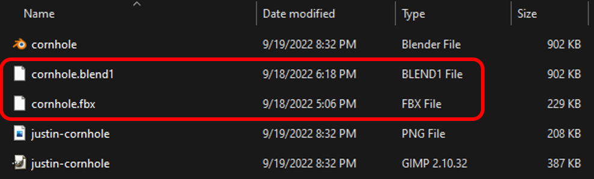
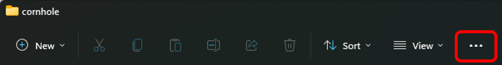
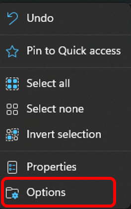
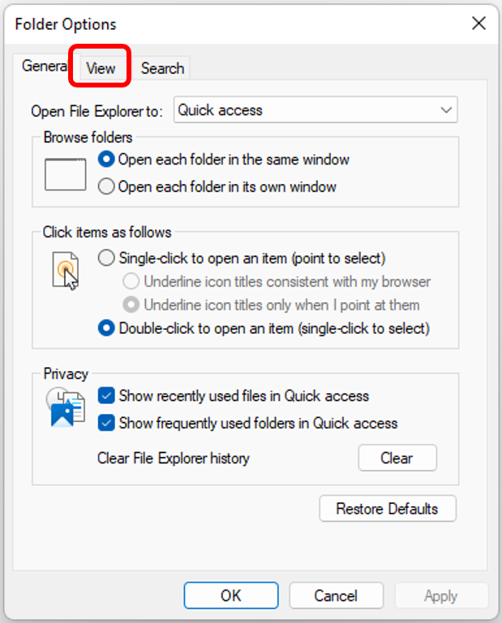
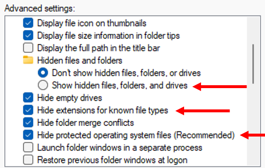
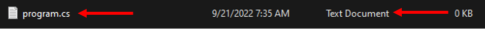
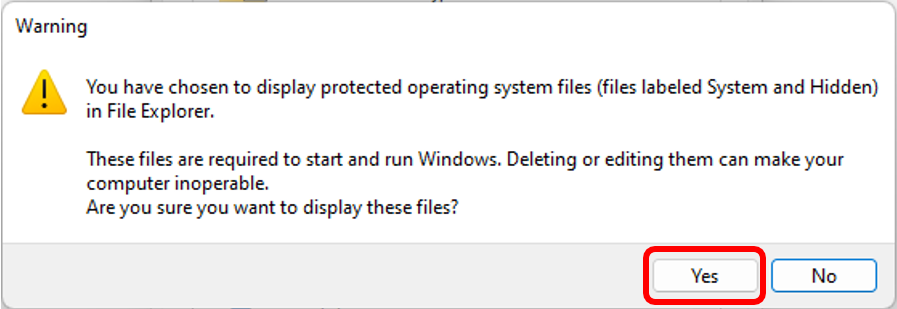
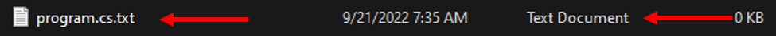
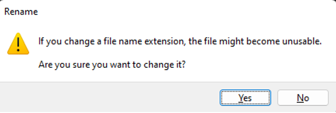
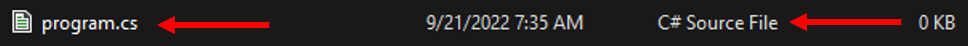

# Getting Started Working and Contributing
This guide is an introduction to how to get started contributing to the VRCreatorAcademy/vr-creator-academy-collab project.

# How to Fork the Repo and Copy the Repo URL
1.	Sign up for a github.com account (if you do not already have one) and login.
2.	Get a git client tool to use on your computer.  There are many here are a few:

| Tool                           | Platform(s)   | Cost  | Note                                   |
|--------------------------------|---------------|-------|----------------------------------------|
| gitk  & git gui                | Win/Mac/Linux | Free  | Original git graphical user interface  |
| https://tortoisegit.org/       | Win           | Free  |                                        |
| https://www.sourcetreeapp.com/ | Win/Mac       | Free  |                                        |
| https://www.gitkraken.com/     | Win/Mac/Linux | Free* | *Free for public repos only            |

Used in this document
3.	Navigate to the upstream repo:
- https://github.com/VRCreatorAcademy/vr-creator-academy-collab
- An upstream repo is one that you will be contributing changes to that from your personal fork.
4.	Click on the fork button to make your personal fork of this repo:

5.	You will now have your very own for of the repo in your github account. Click on the repo (notice that it is a Public repo which means that the world can see it).

 

6.	Click on the “Code” then “Copy” button to copy the URL for the repo into your copy buffer.

# How to use GitKraken to Clone the Repo to your Local Machine
What: GitKraken is a git client application.  Git clients are required to clone a repo (cloning means to copy the files from a remote computer to your local computer).
Why GitKraken: Its free for public repos and works on all Win/Max/Linux. Note: this may not be the best tool for the job but it’s a great tool for teaching because: free & cross platform.  Its okay to use a different git client and 
1.	Download and install GitKraken
2.	Sign up with GitHub (you should have an account)

3.	If it worked, it should redirect you to a “Success!” page in a web browser.  If it didn’t work it looks like there is some way to copy a token and paste it into GitKraken.  This “Copy Token” button it beyond the scope of this document.

4.	Create a profile: I just took the default values that it retrieved from github.com by clicking the “Create Profile” button:

5.	Choose “Start with a Repo Tab”

6.	Select Clone a Repo:

7.	Paste the URL obtained from the previous procedure into the URL text box and choose where you want to store the cloned repo on your local computer.

8.	Click “Open Now” to see your newly cloned repo:

9.	Walla, your new repo:

These are branches, you can switch between them by double clicking on them.  If you double click on the main branch you will check it out.
The yellow arrows are commits
The blue arrows are merge points.  A merge is where two branches were merged.
10.	The icons to the right of the branch name indicate if the branch is local or remote.  The icon of the left is the remote computer branch and the icon on the right is the local computer branch.

# Opening The Project in Unity
1.	Open Unity HUB
2.	Click on down arrow next to the Open button then click on “Add project from disk”.

3.	Navigate to the cloned git repo.  The Unity project is in this sub directory, double click to enter the Unity project:

4.	Click the “Add Project” button:

5.	Take note of the Unity version. If you do not have the required version installed, then you need to click on the install tab and install the require version. 
**DO NOT OPEN THE PROJECT WITH THE INCORRECT VERSION OF UNITY**.

6.	Click on the project name to open the project in the Unity Editor.  You can now explore and make changes to the project.
## Contributing Back Your Changes
I need to get to work so I will write this section later, probably when someone starts asking for it.
 
# Windows Hidden File Extensions (Optional)
In ancient history file names on Windows / DOS computer were limited to eight characters a dot and then three more 
characters.  These are known today as 8.3 filenames.  The first eight characters are the name of the file and the 
last three character are known as the extension.  The extension is a code that is used to identify the type of file
(what kind of data and how it is stored).  Microsoft introduced long file names (LFN) in Windows 95 (Yay!) as well 
as a patent for the technology for making LFN’s work with 8.3 file names (Boo, though the patent has since expired).
The long file names broke the 8.3 limitations for both the name and the extension.  Somewhere along the line started
Windows started suppressing the file extension when it didn’t know what it meant.  The extension is still there but 
you can’t always see them as seen here:

In the above image Windows doesn’t know what a .blend1 nor a .fbx file types are so it displays the extension.  
However, it does know what a .blend, .png and a .xcf file are and thus it suppresses the extension and doesn’t show 
it.  It does show a description in the “Type” column but not the extension itself.
I find this utterly confusion and more than slightly frustrating.  The good news is they do provide a method for 
turning off a feature that I do not want.  And I highly recommend for any software developers out there to turn this 
feature off to save confusion and frustration.  Luckily its quite easy to turn off.  Here is how to do it.
1.	In the file explorer click the three dots dropdown:

2.	Click on the “Options” option:

 
3.	Click on the “View” tab:

4.	Finally, we can access the thing Microsoft is trying to protect you from:

I recommend changing the following settings:
1.	Set Hidden files and folder to: “Show hidden files, folders and drives”
a.	Why: Sometimes hidden files are created that are needed by your application.  If the files are hidden in the file explorer and you are trying to copy your program to another folder they may not come along and prevent your program from working.
2.	Turn off “Hide extensions for known file types”
a.	Sometimes you will need to create or rename a file with a given extension.  If the extension is hidden you cannot alter it.  This leads to the following problems.
i.	Rename from program.c to program.cs: Since you cannot access the extension you cannot change it.
ii.	Create a file called program.cs.  This file got created and it looks like it has a .cs extension but its really a .txt file:

3.	Turn off “Hide protected operating system files (Recommended)
a.	Windows programs use shared libraries called “DLL”’s (Dynamic Linked Libraries).  If these are hidden in the file explorer and you are trying to copy your program to another folder they may not come along and prevent your program from working.
b.	When you turn this one off Windows really trys to convince you not to do it with the following message:

c.	Just click “Yes”.
4.	When complete you can see the real name of the file we tried to create above:

5. Finally, we can rename it to the proper extension of .cs to which Microsoft will now give us a warning:

6.	Now look at that, the file has the right extension and Windows still know what file type it is:

